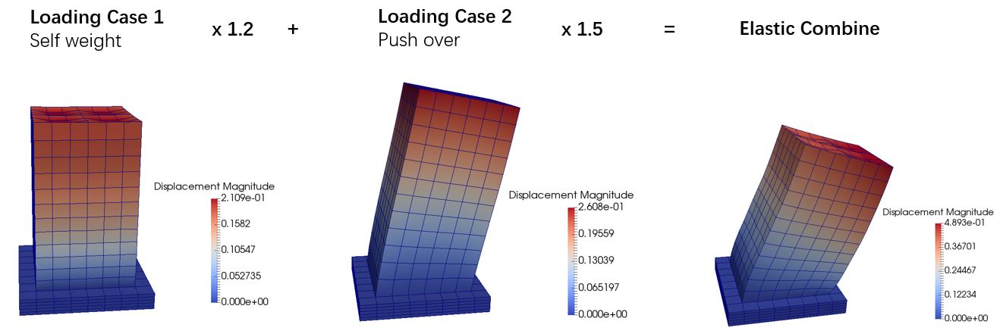

### Real-ESSI HDF5 File Operations (C++)

Using HDF5-CPP API to combine Real-ESSI outputs.

#### Dependencies
* hdf5 library
* hdf5_cpp library
* C++ 11
You may need to modify the Makefile to link the HDF5 library location properly.

#### User Input (See main.cpp)
* a text file which contains 
	- a list of HDF5 filenames 
	- a list of the corresponding load factors.
* the output filename.

#### Output
* a combined HDF5 output which contains all the loading cases with the corresponding load factors.

#### Test
Verified on Ubuntu 16.04 with gcc 5.4

#### Example

