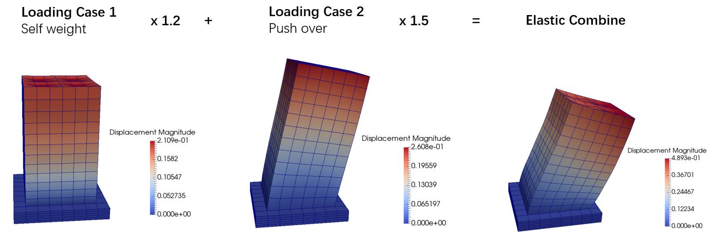

### Real-ESSI HDF5 File Operations

These are the HDF5 file operations to combine Real-ESSI outputs.

#### Input 
* a text file which contains 
	- a list of HDF5 filenames 
	- a list of the corresponding load factors.
* the output filename.

#### Output
* a combined HDF5 output which contains all the loading cases with the corresponding load factors.

#### Example

HDF5 output files are the loading case 1 and case 2.
Load Factor are 1.2, 1.5 respectively.

